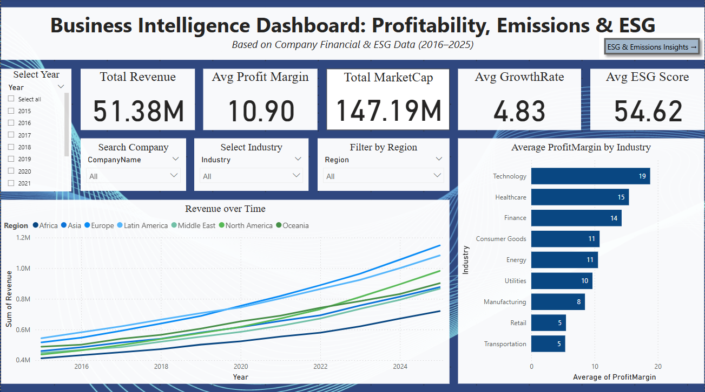
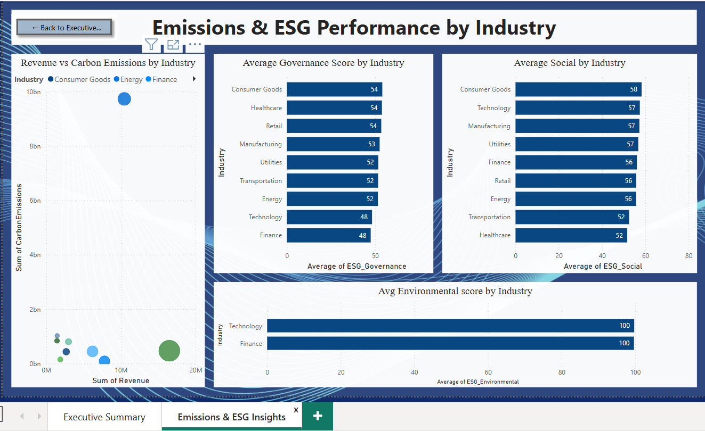

# Business Intelligence Dashboard: Profitability, Growth & ESG Insights

This project uses Power BI to build an **interactive dashboard** that helps **business stakeholders** explore company financials, profitability trends, carbon emissions, and ESG (Environmental, Social, Governance) performance.

---

## Project Objective

- Analyze company performance across financial and sustainability KPIs
- Create an interactive dashboard using Power BI visuals, slicers, and navigation
- Provide insights for strategic business and ESG-related decisions

---

## Dataset Overview

- **Source**: Kaggle  
- **Type**: Company-level Financial + ESG dataset  
- **Fields Include**:
  - `Revenue`, `ProfitMargin`, `MarketCap`, `GrowthRate`
  - `CarbonEmissions`, `Region`, `Industry`, `Year`
  - `ESG_Environmental`, `ESG_Social`, `ESG_Governance`
 
[Company ESG Financial Dataset on Kaggle](https://www.kaggle.com/datasets/shriyashjagtap/esg-and-financial-performance-dataset)

---

## Step-by-Step: What i've done

### 1. Imported Dataset into Power BI
- Loaded the CSV file: `company_esg_financial_dataset.csv`

---

### 2. Cleaned the Data using Power Query
- Opened **Power Query Editor**
- Checked data types and column quality
- Found 91 nulls in `GrowthRate` column
- **Replaced null values with average (4.83)** directly (without creating a new column)

---

### 3. Created KPI Cards (Page 1)

- Added **Card visuals** for:
  - Total Revenue (Sum)
  - Average Profit Margin
  - Total Market Cap (Sum)
  - Average Growth Rate
  - Average ESG Score (derived from ESG_Environmental, Social, Governance)

---

### 4. Added Slicers

- **Year Slicer**: Horizontal Tile layout
- **Industry Slicer**: Vertical List
- **Region Slicer**: Vertical List
- **Company Name Slicer**: Set to Dropdown with Search enabled

---

### 5. Visuals on Executive Summary (Page 1)

- **Line Chart**: Revenue over Time (X: Year, Y: Revenue, Legend: Region)
- **Bar Chart**: Profit Margin by Industry
- **Scatter Plot**: Revenue vs Carbon Emissions
  - X-axis: Carbon Emissions  
  - Y-axis: Revenue  
  - Bubble Size: Market Cap  
  - Legend: Industry

---

### 6. Visuals on ESG & Emissions Dashboard (Page 2)

- **3 Clustered Bar Charts**:
  - ESG_Environmental by Industry
  - ESG_Social by Industry
  - ESG_Governance by Industry

- **Scatter Plot**: Revenue vs Emissions by Industry (same fields as above)

---

### 7. Created Navigation Buttons

- Added navigation **buttons to switch pages**:
  - **From Page 1 → Page 2** ("View ESG & Emissions Insights →")
  - **From Page 2 → Page 1** ("← Back to Executive Summary")
- Used **Action → Page Navigation** feature in Power BI

---

## Key Insights

### Executive Summary
- Revenue has steadily increased (2016–2025), especially in **Asia** & **Europe**
- **Technology** sector has the highest **Profit Margin (19%)**
- Market Cap and Revenue are strongest in large-cap industries

### ESG & Emissions
- **Technology & Finance** have perfect **Environmental scores**
- **Energy sector** has highest carbon emissions but not the highest revenue
- **Consumer Goods & Tech** lead in Social scores
- ⚖Governance scores are higher in **Consumer-facing industries**

---

## Files in this Repository

| File Name | Description |
|-----------|-------------|
| `executive-summary.png` | Screenshot of Dashboard Page 1 |
| `emissions-esg-performance.png` | Screenshot of Dashboard Page 2 |
| `Business intelligence dashboard.pptx` | 10-slide summary of project, visuals, and insights |
| `README.md` | Full project explanation, steps, and insights |

---

## Deliverables

- **Two-Page Power BI Dashboard**
- Interactive filters & visualizations
- Navigation buttons between pages
- Summary presentation

---

## Thank You

This dashboard empowers stakeholders to make **data-driven business** and **sustainability decisions** with clarity and interactivity.

> Created by: **Rajeshwari Agnimandala**  
> June 2025 | Built using Power BI
